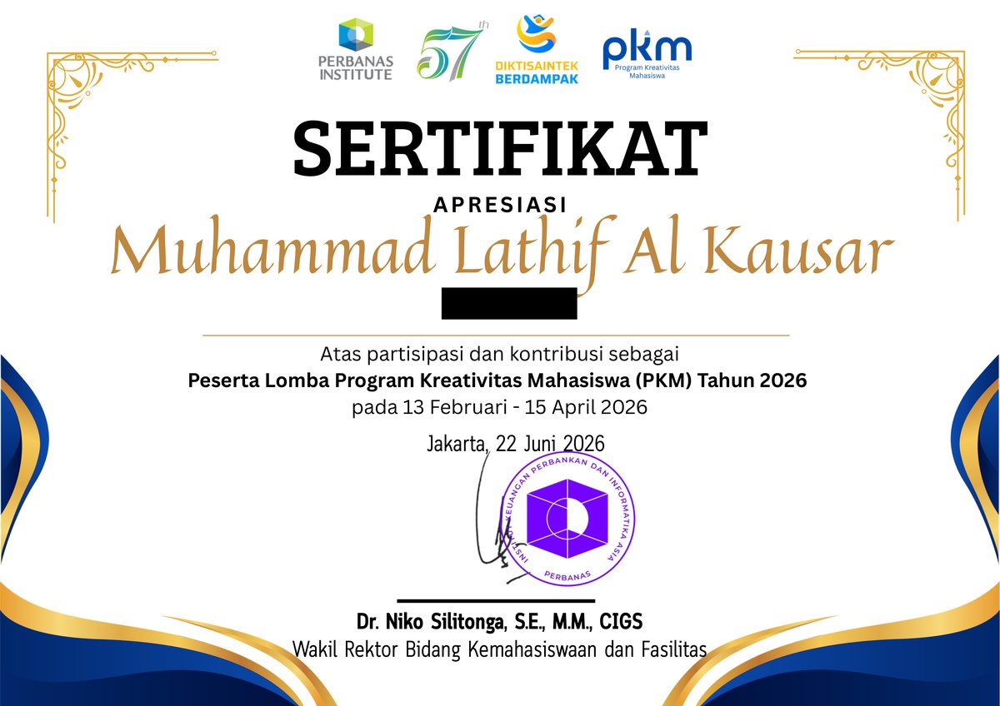

+# Achievements

Kumpulan sertifikat dari kegiatan akademik dan non-akademik. Dipisah dari repo project supaya tiap repo project tetap fokus ke kode, sementara dokumentasi pencapaian terkumpul di satu tempat.

---

## Daftar Sertifikat

| No | Kegiatan | Penyelenggara | Tanggal | Kategori |
|----|----------|---------------|---------|----------|
| 01 | Lomba Program Kreativitas Mahasiswa (PKM) 2026 | Perbanas Institute | 13 Feb – 15 Apr 2026 | Akademik |
| 02 | Kuliah Umum — Building Feature-Ready Talent for the Digital Banking Era | BRI x Perbanas Institute | 12 Jun 2026 | Kuliah Umum |
| 03 | DIKDAS FTI 2026 — Encouraging A Generation Of Wise and Responsible Digital Natives | FTI Perbanas Institute | 30 Jan – 1 Feb 2026 | Pelatihan |
| 04 | Seminar Data Science Day 2025 | HIMASDA Perbanas Institute | 20 Nov 2025 | Seminar |
| 05 | Pelatihan Introduction to SQL | HIMSI Perbanas Institute | 7 Nov 2025 | Workshop |
| 06 | Seminar UI/UX — Technoupdate X HIMPACT 2025 | HIMSI Perbanas Institute | 16 Okt 2025 | Seminar |
| 07 | Workshop Sertifikasi Data Scientist | HIMASDA Perbanas Institute | 31 Okt 2025 | Workshop |

---

## Detail Sertifikat

### 01 — Sertifikat Apresiasi PKM 2026

Diberikan oleh Perbanas Institute atas partisipasi sebagai peserta **Program Kreativitas Mahasiswa (PKM) Tahun 2026**, terkait pengembangan project [WARUNGKU](https://github.com/mlathif2307-lab/projek-warungku) — aplikasi digitalisasi manajemen UMKM.

*Klik gambar untuk membuka versi PDF.*

---

### 02 — Kuliah Umum: Building Feature-Ready Talent for the Digital Banking Era

Diberikan sebagai peserta **Kuliah Umum** yang diselenggarakan oleh **BRI x Perbanas Institute** pada 12 Juni 2026 di Jakarta.

---

### 03 — DIKDAS FTI 2026

Diberikan sebagai peserta **Pendidikan Dasar (DIKDAS) Fakultas Teknologi Informasi 2026** dengan tema *"Encouraging A Generation Of Wise and Responsible Digital Natives"*, dilaksanakan pada 30 Januari – 1 Februari 2026 di Wisma Tugu, Cisarua.

---

### 04 — Seminar Data Science Day 2025

Diberikan sebagai peserta **Seminar Data Science Day 2025** yang diselenggarakan oleh **Himpunan Mahasiswa Sains Data (HIMASDA)** Perbanas Institute pada 20 November 2025 di Jakarta.

---

### 05 — Pelatihan Introduction to SQL

Diberikan sebagai peserta **Pelatihan Introduction to SQL** yang diselenggarakan oleh **Himpunan Mahasiswa Sistem Informasi (HIMSI)** Perbanas Institute pada 7 November 2025.

---

### 06 — Seminar UI/UX: Technoupdate X HIMPACT 2025

Diberikan sebagai peserta seminar dalam acara **Technoupdate X HIMSI Tech and Creativity Competition (HIMPACT) 2025 UI/UX Design Competition** yang diselenggarakan oleh **HIMSI Perbanas Institute** pada 16 Oktober 2025.

---

### 07 — Workshop Sertifikasi Data Scientist

Diberikan sebagai peserta **Workshop Sertifikasi Data Scientist** yang diselenggarakan oleh **Himpunan Mahasiswa Sains Data (HIMASDA)** Perbanas Institute pada 31 Oktober 2025 di Jakarta.

---
